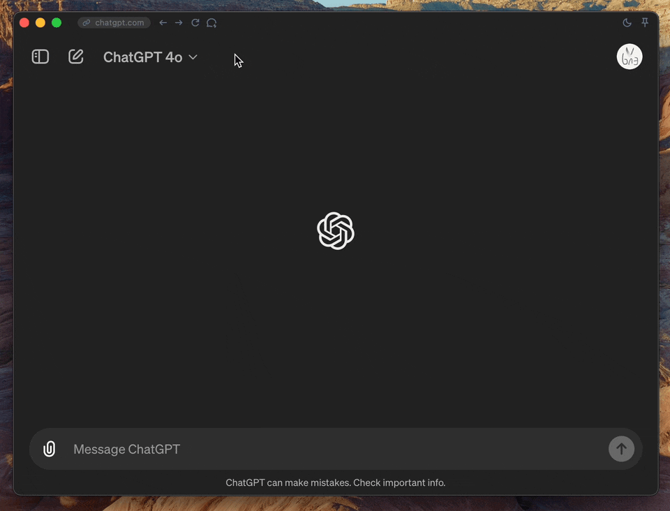

  
  
ChatGPT Desktop Application (Available on Mac, Windows, and Linux)

---

Thank you very much for your interest in this project. OpenAI has now released the macOS version of the application, and a Windows version will be available later ([Introducing GPT-4o and more tools to ChatGPT free users](https://openai.com/index/gpt-4o-and-more-tools-to-chatgpt-free/)). If you prefer the official application, you can stay updated with the latest information from OpenAI.

I am currently looking for some differentiating features to develop version 2.0. If you are interested in this, please stay tuned.

